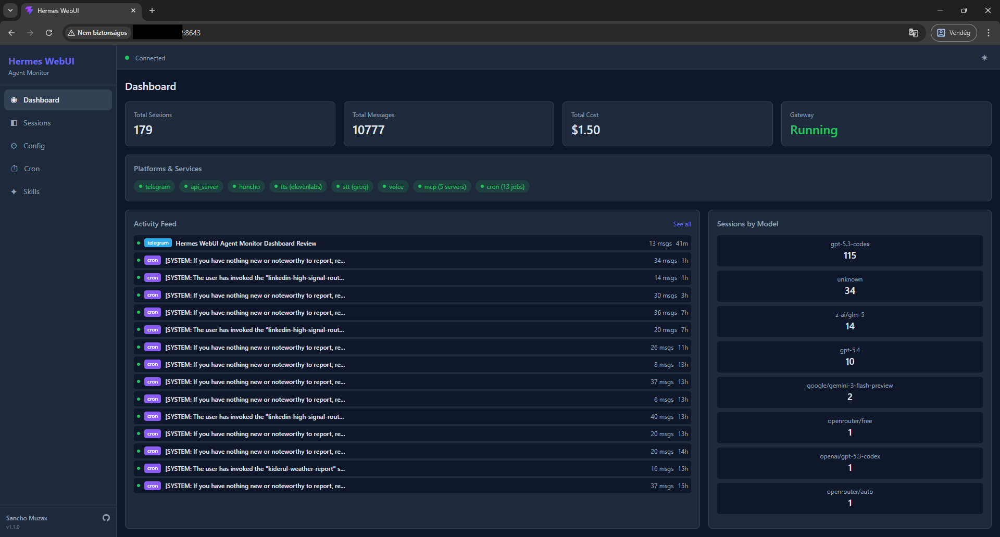
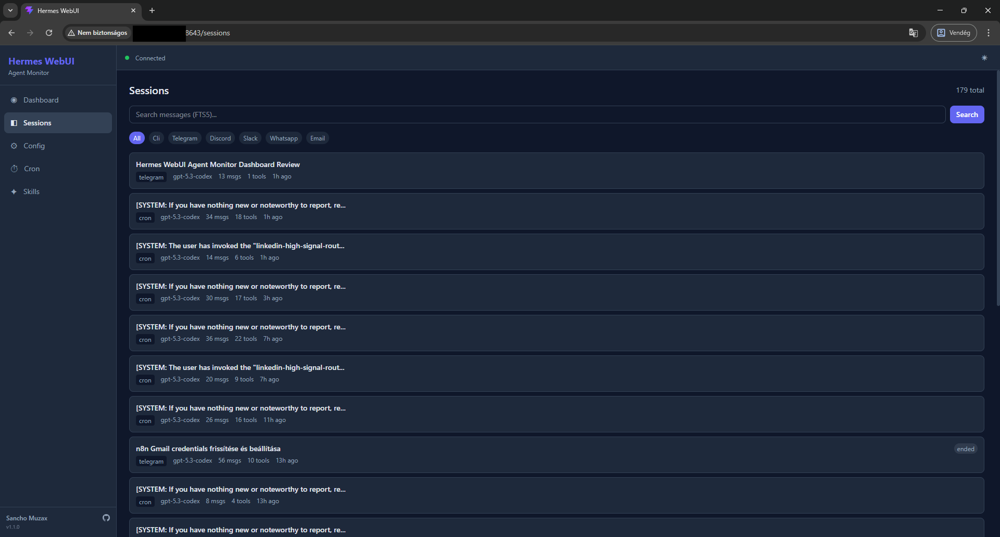
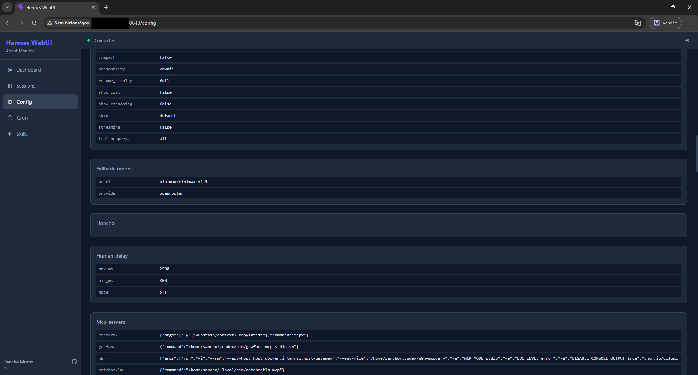
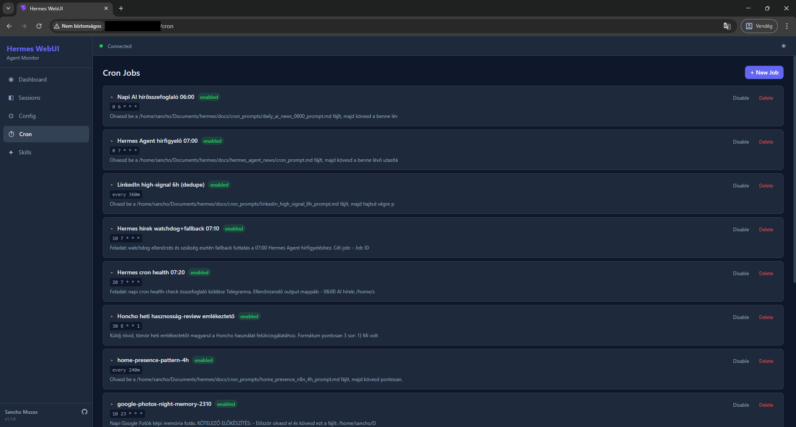
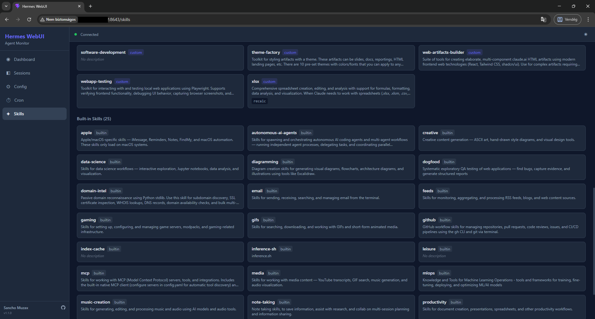

# Hermes WebUI

Process monitoring and configuration dashboard for [Hermes Agent](https://github.com/NousResearch/hermes-agent).



## Features

- **Dashboard** — Real-time activity feed with session list, gateway status, platform/service health, cost tracking, and model distribution
- **Sessions** — Browse, search (FTS5), and inspect full conversation histories with message-level detail
- **Config** — View `config.yaml` and environment variables (read-only for safety)
- **Cron** — View and manage scheduled agent jobs
- **Skills** — Browse built-in and custom skills with full source inspection
- **Responsive** — Mobile-friendly layout with hamburger menu
- **Dark/Light theme** — Toggle between themes
- **Real-time updates** — WebSocket-based polling bridge, no agent code modification needed

## Screenshots

| Dashboard | Sessions |
|---|---|
|  |  |

| Config | Cron Jobs |
|---|---|
|  |  |

| Skills |
|---|
|  |

## Requirements

- Python 3.11+
- Node.js 18+ (for frontend build only)
- A running [Hermes Agent](https://github.com/NousResearch/hermes-agent) installation at `~/.hermes/`

## Installation

### 1. Clone the repository

```bash
git clone https://github.com/sanchomuzax/hermes-webui.git
cd hermes-webui
```

### 2. Set up Python environment

```bash
python3 -m venv venv
source venv/bin/activate
pip install -e .
```

### 3. Build the frontend

```bash
cd frontend
npm install
npx vite build
cd ..
```

### 4. Run

```bash
hermes-webui
```

Or directly:

```bash
python -m webui
```

Output:

```
Starting Hermes WebUI at http://0.0.0.0:8643
Auth token: <your-auth-token>
```

### 5. Log in

Open `http://<your-host>:8643` in a browser and paste the **auth token** shown in the console output.

The token is generated once and stored in `~/.hermes/auth.json`. To retrieve it later:

```bash
python3 -c "import json; print(json.load(open('$HOME/.hermes/auth.json'))['webui_token'])"
```

## Configuration

| Environment Variable | Default | Description |
|---|---|---|
| `HERMES_HOME` | `~/.hermes` | Hermes Agent installation directory |
| `HERMES_WEBUI_HOST` | `0.0.0.0` | Bind address |
| `HERMES_WEBUI_PORT` | `8643` | Port |

### CLI flags

| Flag | Description |
|---|---|
| `--localhost` | Bind to `127.0.0.1` only (not accessible from LAN) |
| `--port PORT` | Override the default port |

## Running as a systemd service

Create `/etc/systemd/system/hermes-webui.service`:

```ini
[Unit]
Description=Hermes WebUI
After=network.target

[Service]
Type=simple
User=YOUR_USER
WorkingDirectory=/home/YOUR_USER/.hermes/hermes-webui
ExecStart=/home/YOUR_USER/.hermes/hermes-webui/venv/bin/python -m webui
Restart=on-failure
RestartSec=5
Environment=HERMES_HOME=/home/YOUR_USER/.hermes

[Install]
WantedBy=multi-user.target
```

Then enable and start:

```bash
sudo systemctl daemon-reload
sudo systemctl enable hermes-webui
sudo systemctl start hermes-webui
```

Check status:

```bash
sudo systemctl status hermes-webui
journalctl -u hermes-webui -f
```

> **Note:** When running as a service, the auth token is not printed to your terminal. Retrieve it from `~/.hermes/auth.json` as shown above.

## Architecture

```
┌─────────────────────────────────────────┐
│  React Frontend (Vite + TailwindCSS)    │
│  SPA with TanStack Query + WebSocket    │
└────────────────┬────────────────────────┘
                 │ HTTP + WS
┌────────────────┴────────────────────────┐
│  FastAPI Backend (Python)               │
│  ├─ REST API (sessions, config, cron)   │
│  ├─ WebSocket hub (live events)         │
│  └─ Polling bridge (state.db + files)   │
└────────────────┬────────────────────────┘
                 │ SQLite (read-only) + YAML
┌────────────────┴────────────────────────┐
│  Hermes Agent (unmodified)              │
│  state.db, config.yaml, gateway_state   │
└─────────────────────────────────────────┘
```

Hermes WebUI reads from the agent's data files without modifying the agent's core code.

## Tech Stack

- **Backend**: Python 3.11+, FastAPI, Uvicorn, Pydantic, PyYAML
- **Frontend**: React 19, TypeScript, Vite, TailwindCSS 4, TanStack Query
- **Data**: SQLite (read-only from Hermes Agent's `state.db`)

## Pages

| Page | Description |
|---|---|
| **Dashboard** | KPI cards (sessions, messages, cost, gateway), platform badges, activity feed with live session list, model distribution |
| **Sessions** | Paginated session list with FTS5 search, source filter tabs, click into any session to view full message history |
| **Config** | Read-only view of `config.yaml` sections and `.env` variables (sensitive values masked) |
| **Cron** | List of scheduled cron jobs with status, schedule, and prompt preview |
| **Skills** | Grid of built-in and custom skills with description, click to view full source |

## Troubleshooting

### "Cannot connect to server" on login
- Make sure the WebUI server is running
- If accessing from another machine, ensure the server is bound to `0.0.0.0` (default), not `127.0.0.1`

### Dashboard shows no sessions
- Verify Hermes Agent has been used at least once (check `~/.hermes/state.db` exists)
- The WebUI reads `state.db` in read-only mode — if the agent is actively writing, there may be a brief WAL lock delay

### Activity Feed not updating
- The polling bridge checks `state.db` every 3 seconds
- Ensure the WebSocket connection shows "Connected" (green dot in the header)

## Related

- [Hermes Agent](https://github.com/NousResearch/hermes-agent) — The AI agent this UI monitors
- [OpenClaw Web UI](https://docs.openclaw.ai/web) — Inspiration for the dashboard design

## Built With

This project was vibe-coded with [Claude Code](https://claude.ai/claude-code) (Claude Opus 4.6).

## License

MIT
